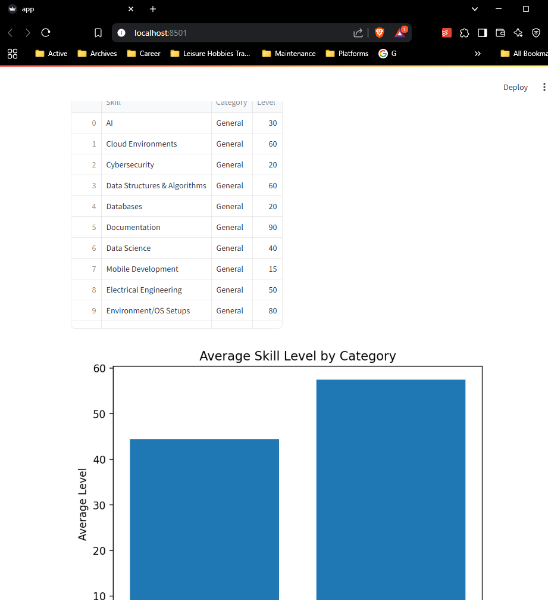
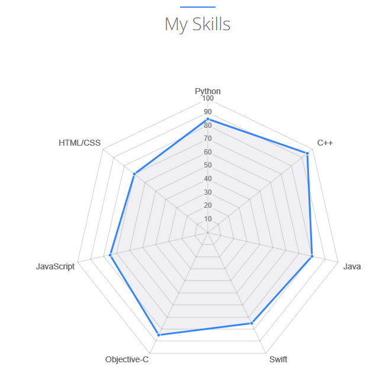

# streamlit-dash
A data-science streamlit dashboard of my learning goals.

Notes, mostly for myself, can be found [here](https://notebook.mchase.me/career/compsci-and-development/data-analytics-and-vizualization/py.streamlit-package/streamlit-dashboard-w-dvc)

Here's sort-of what I'm going for:

